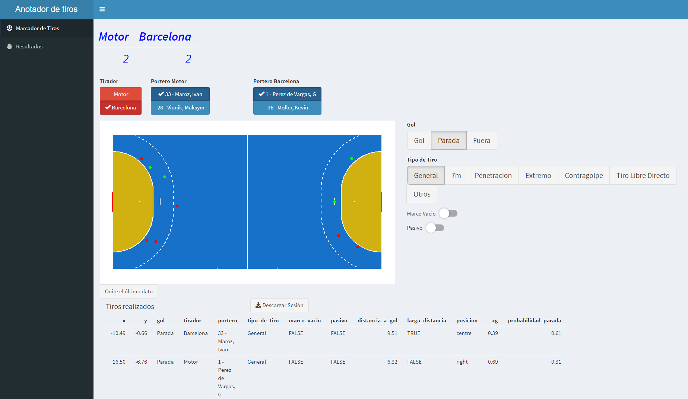
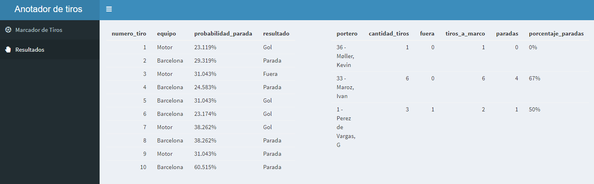
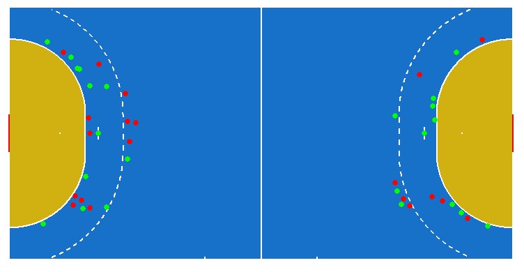
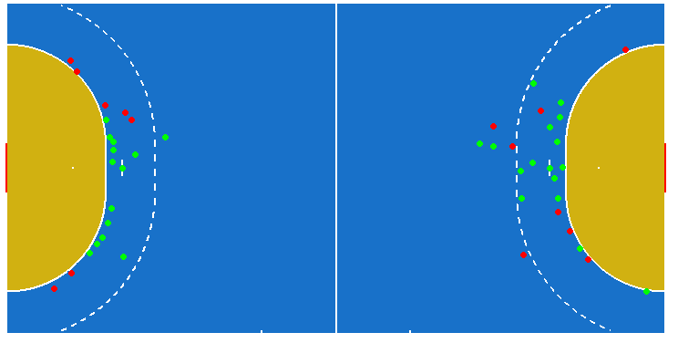

**Nota: el código completo que genera este archivo html se puede encontrar [aquí](https://github.com/telaroz/colaborativa2/blob/master/tarea2.Rmd).**


# Planteamiento del Ejercicio 

Establecer un valor de 0% a 100% de probabilidad de parada de cada uno de los 10 primeros lanzamientos que aparecen en el vídeo de lanzamientos de plataforma en el módulo 2 (hasta 0 minutos y 50 segundos en el vídeo, aparece en la esquina superior izquierda el número de lanzamiento).

Cada valor puede establecerse de manera cualitativa sin necesidad de apoyarse en valores de referencia mostrados anteriormente, aunque pueden consultarse tablas de módulo 1 si se desea.

# Solución

## Definición del marco de referencia para la probabilidad de parada.


Los valores de referencia tomados para este ejercicio, son los datos del play by play de todos los partidos del mundial masculino de egipto 2021. 
En este punto se hace un supuesto de que la probabilidad de parada es el inverso de la probabilidad de gol (xg), sin embargo una parte de este inverso debería considerarse en la probabilidad de fallar un tiro ya que goles esperados captura la categoría 'Gol' y la categoría 'No Gol' contiene las paradas de las porterías y los fallos del ataque. 


Esta tabla se generó de manera idéntica a la que aparece en la tarea colaborativa 1. Los detalles del cálculo se pueden encontrar **[aquí](https://telaroz.github.io/colaborativa1/)**.

```{r, echo = FALSE}
library(magrittr)

tabla <- data.table::fread('data/xg_egipto.csv')

kableExtra::kable(tabla) %>%
  kableExtra::kable_styling(full_width = FALSE)
```


## Herramienta de marcaje de tiros


Para la realización de este ejercicio se creó una aplicación 100% con código R con el paquete **[shiny](https://shiny.rstudio.com/)** para marcar la posición junto con el tipo de tiro, para generar automáticamente la probabilidad de parada según esta información. Esta aplicación está disponible para su uso libre en <https://telaroz.shinyapps.io/colaborativa2/> y es posible generalizarla a equipos y jugadores en distintos contextos. El código fuente de esta aplicación está alojado en este **[repositorio](https://github.com/telaroz/colaborativa2/)** (escrito en su totalidad en el lenguaje de programación R) y la misma aplicación puede correr en una versión local. Debido a las limitaciones del servidor donde está alojada la aplicación, se recomienda esta opción. En el **[anexo](https://telaroz.github.io/colaborativa2#anexo)** se explica de manera básica cómo ejecutar esta aplicación en RStudio.  


## Solución primeros 10 tiros. 

Se marcaron los 10 primeros tiros y estos fueron los resultados:


{width=150%}   




A partir del marcaje de los tiros, la tabla con la probabilidad de parada para cada tiro es generada automáticamente, así como estadísticas sobre las porterías. Debido a esta posición no suele ser cambiada con frecuencia, el trabajo adicional de seleccionar quién se encuentra en el marco para obtener estas estadísticas es marginal.


## Marcaje de todos los tiros del partido. 

Gracias a que en el video está delimitado cada uno de los tiros de un partido completo, se aprovecha la aplicación creada para marcar todos los tiros de manera fácil y rápida. Aquí es importante resaltar que el tiro etiquetado en el video como el número 53, en realidad contiene información sobre 2 tiros, uno que parece parado por el portero. De esta forma, en los próximos resultados mostrados, el tiro 53 y 54 corresponden al número 53 del vídeo. 


Este es el resultado del marcaje para el primer y segundo tiempo respectivamente:








A partir de dichos datos se obtuvieron los resultados de probabilidad de parada para cada tiro y el porcentaje de paradas para cada portería. Ambos se detallan a continuación.


**Probabilidad de parada de los 91 tiros del partido**
```{r, echo = FALSE}
tiros <- data.table::fread('tiros_resultados.csv')

DT::datatable(tiros)
```


**Porcentaje de paradas para cada portería**
```{r, echo = FALSE}
tabla_porteros <- data.table::fread('resultados_porteros.csv')

kableExtra::kable(tabla_porteros) %>%
  kableExtra::kable_styling(full_width = FALSE)
```


Por último, se muestran los datos crudos que surgieron a partir de la recopilación de los tiros. Las dos últimas columnas fueron agregadas manualmente como información de refencia. 

**Datos crudos generados por el marcaje del partido completo**
```{r, echo = FALSE}
tiros_raw <- data.table::fread('colaborativa2_raw.csv')

DT::datatable(tiros_raw)
```


# Siguientes pasos

Estos datos de eventing que contienen las variables 'Tipo de Tiro', 'Pasivo' además de las coordenadas x/y desde donde se toma el tiro, son un gran inicio para crear un modelo de goles esperados (xg) más robusto que la simple división de cantidad aciertos/cantidad de tiros por posición de tiro. Es claro que un lanzamiento de extremo con un buen ángulo tendrá mayor probabilidad de éxito que otro con menor ángulo. Un modelo de XG más continuo podría ser generado empezando con simples mapas de calor por posición. Sin embargo, con suficientes datos funcionaría mejor un modelo entrenado con una regresión logística, redes neuronales o con XGboost, que es el estándar en modelos XG en fútbol. 

# Anexo


## Instalación básica de programas

Para poder ejecutar la aplicación, es necesario instalar R. La descarga se encuentra [**aquí**](https://cloud.r-project.org/)


Además, para facilidad en el desarrollo y ejecución de código R, es importante instalar un entorno de desarrollo integrado. Este se puede instalar desde [**aquí**](https://rstudio.com/products/rstudio/download/)


Por último, para poder descargar el repositorio directamente de github, es necesario instalar Git. Desde [**aquí**](https://git-scm.com/download/) la descarga.


**Nota: Descargar git y copiar el repositorio directamente en RStudio es altamente recomendable pero opcional. Otra alternativa es descargar los archivos del repositorio y abrir el archivo colaborativa2.Rproj. Después de esto, se puede continuar con los pasos de ejecución de la aplicación detallados en la sección 4.3. **

## Copia del repositorio de la aplicación

Ya descargados e instalados R y RStudio, se abre RStudio y la página del repositorio <https://github.com/telaroz/colaborativa2/>

Los pasos (mostrados en el gif a continuación) para copiar el repositorio (con sus archivos) en la computadora son los siguientes: 

- Crear un nuevo proyecto en RStudio.
- Seleccionar Version Control
- Seleccionar Git
- Copiar el link de git del repositorio (en este caso https://github.com/telaroz/colaborativa2.git)
- Pegarlo en RStudio y escoger la carpeta donde guardaremos el proyecto y todos los archivos


## Ejecución de la aplicación

Ahora se abre el archivo colaborativa2.R y se ejecuta la aplicación con el botón __Run__. 


La aplicación se desplegará en una ventana. Para una mejor experiencia es posible abrirla en el navegador y en pantalla completa.


Las tres líneas horizontales abren y colapsan el menú de pestañas de la aplicación.


